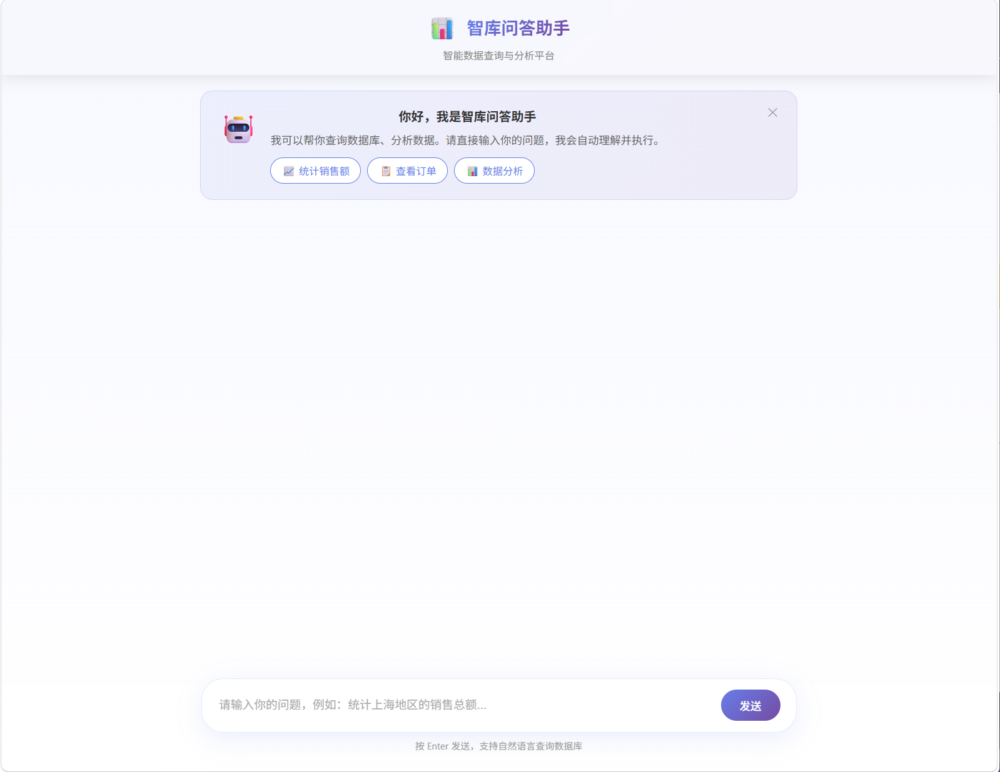
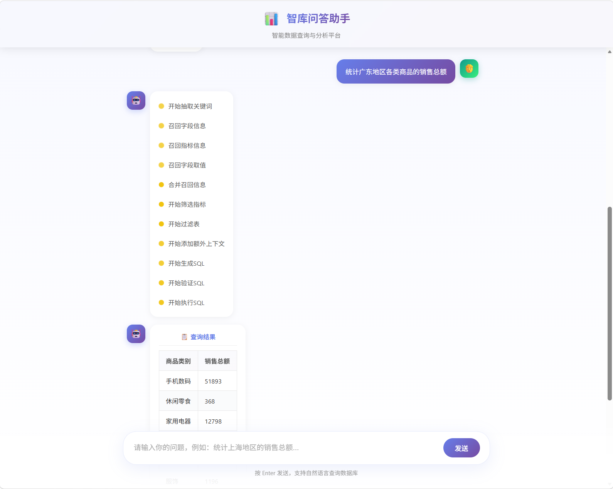
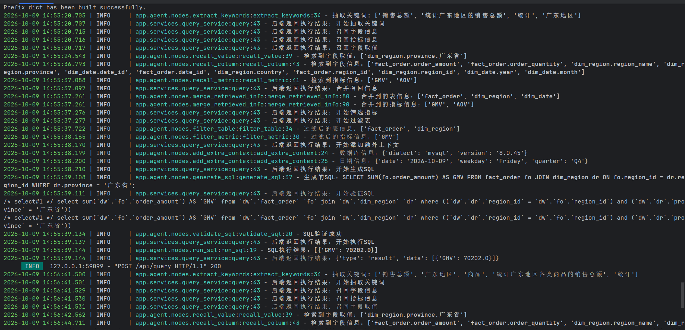
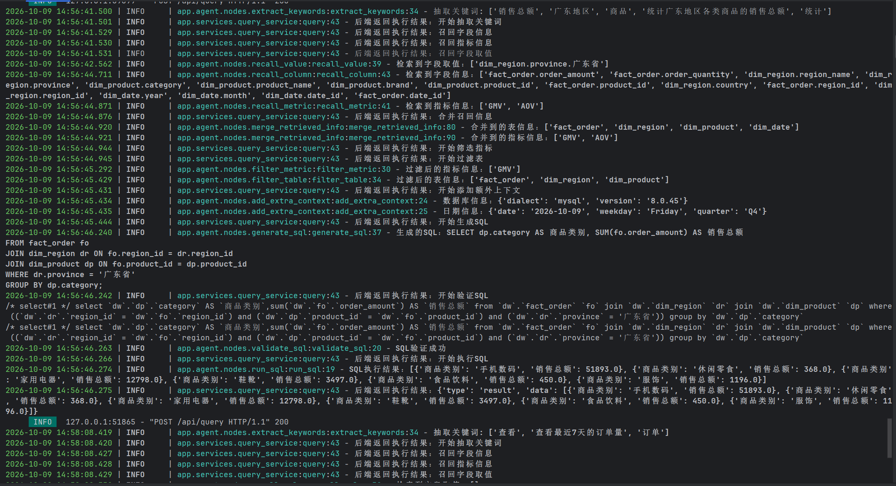
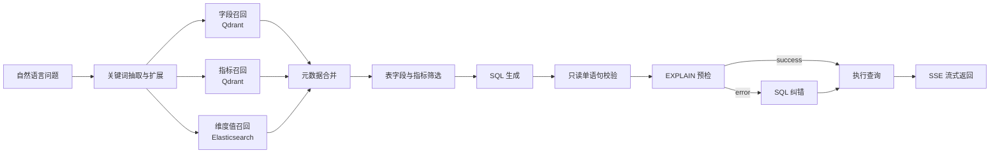

# 数据仓库 NL2SQL Agent


面向数据仓库场景的 NL2SQL 智能问数系统。用户使用自然语言提问，系统检索表、字段、指标和维度值等元数据，生成并校验 SQL，最后通过 SSE 将 Agent 执行过程和查询结果流式返回前端。

项目重点展示 LLM 应用工程能力：检索增强、Agent 工作流编排、SQL 预检、流式交互和请求级可观测，而不是让模型脱离真实 Schema 直接“猜” SQL。

## 项目亮点

| 问题 | 解决方法 | 效果 |
| --- | --- | --- |
| 业务人员不了解数据库结构和 SQL | 用 FastAPI + LangGraph 编排 NL2SQL 工作流 | 实现从自然语言提问到结构化查询结果的端到端闭环 |
| 业务语言与物理字段、指标口径和真实维度值存在语义差异 | 用 Qdrant 召回字段与指标，用 Elasticsearch 检索维度值 | 为 SQL 生成提供真实且可追溯的 Schema 上下文，降低字段臆造与条件错配风险 |
| 全量 Schema 上下文冗余，容易干扰复杂查询 | 并行执行字段、指标和字段值三路召回，再进行合并与二次筛选 | 缩小 SQL 生成的候选范围，同时保留 JOIN 所需的主外键关系 |
| LLM 输出不能被当作可信 SQL 直接执行 | 在 Prompt 约束外增加代码级只读校验，拒绝写操作、多语句、注释和文件导出，再用 `EXPLAIN` 预检 | 阻止非 `SELECT`/CTE 语句进入数据库，并为校验失败后的一次 SQL 纠错提供错误上下文 |
| Agent 执行时用户无法感知中间状态 | 用 SSE 流式推送节点进度和查询结果 | 前端可视化展示召回、筛选、SQL 生成、校验与执行过程 |

## 运行结果

完整演示步骤见 [docs/demo.md](docs/demo.md)。

### 首页与问数入口

<p align="center">
  
</p>

### Agent 执行过程与查询结果

演示问题：**统计广东地区各类商品的销售总额**。页面逐步展示关键词抽取、字段/指标/字段值召回、上下文合并、SQL 生成、预检和执行，最后返回分类汇总结果。

<p align="center">
  
</p>

### 后端执行链路

下图展示两类真实运行样例：广东地区 GMV 汇总，以及广东地区各商品类别销售额统计。日志可跟踪召回内容、候选表与指标、生成 SQL、`EXPLAIN` 校验和最终查询结果。

<p align="center">
  
</p>

<p align="center">
  
</p>

## 工作流



## 技术栈

| 层级 | 技术 |
| --- | --- |
| Agent 编排 | LangGraph、LangChain |
| 后端服务 | Python 3.12、FastAPI、SQLAlchemy、asyncmy、SSE |
| 检索增强 | Qdrant、Elasticsearch、BGE-large-zh-v1.5 |
| 数据存储 | MySQL 8.0 |
| 前端页面 | Vue 3、Vite |
| 本地部署 | Docker Compose |

## 快速开始

### 1. 准备配置

```bash
cp conf/.env.example .env
# 编辑 .env，填写 MySQL 密码和 LLM API Key
```

PowerShell：

```powershell
Copy-Item conf/.env.example .env
```

`conf/app_config.yaml` 使用环境变量读取敏感信息，仓库不会保存真实数据库密码或 API Key。若本机直接运行后端，请将 `.env` 中需要的变量导入当前终端。

### 2. 启动依赖服务

```bash
cd docker
docker compose --env-file ../.env up -d
cd ..
```

依赖服务包括 MySQL、Elasticsearch、Kibana、Qdrant 和 embedding 服务。Embedding 模型在容器第一次启动时由镜像拉取，仓库不包含模型权重。

### 3. 安装后端并构建元数据

```bash
uv sync
uv run python -m app.scripts.build_meta_knowledge -c conf/meta_config.yaml
uv run fastapi dev main.py
```

服务默认监听 `http://127.0.0.1:8000`，可访问 `http://127.0.0.1:8000/docs` 查看 OpenAPI 文档。

### 4. 启动前端

```bash
cd agent-fronted
npm install
npm run dev
```

Vite 开发服务器已将 `/api` 代理到 `http://localhost:8000`。

### 5. 运行测试

```bash
uv run python -m unittest discover -s tests -v
```

测试覆盖 Agent 状态更新、SQL 校验异常路由、纠错 Prompt 上下文、配置加载和只读 SQL 安全边界。

## API 示例

`POST /api/query` 使用 SSE 返回工作流事件：

```bash
curl -N -X POST http://127.0.0.1:8000/api/query \
  -H "Content-Type: application/json" \
  -d '{"query":"统计 2025 年各地区销售总额"}'
```

响应为 `data: {...}` 形式的 SSE 事件，事件可表示节点进度、召回上下文、生成 SQL、查询结果或错误信息。

```text
data: {"event":"node_start","node":"recall_column"}
data: {"event":"node_end","node":"generate_sql","sql":"SELECT ..."}
data: {"event":"result","columns":["region","sales_amount"],"rows":[...]}
```

## 项目结构

```text
app/
  agent/          # LangGraph 状态、节点与工作流
  api/            # FastAPI 路由和依赖注入
  clients/        # MySQL、Qdrant、ES、Embedding 客户端
  repositories/   # 元数据与检索仓储层
  services/       # 查询服务与 SSE 输出
  scripts/        # 元数据构建脚本
agent-fronted/    # Vue 3 可视化客户端
conf/             # 可公开的配置模板
docker/           # MySQL、ES、Qdrant、Embedding 编排
prompts/          # SQL 生成、修复和筛选提示词
tests/            # Agent 节点、配置和 SQL 安全回归测试
```

## 安全说明

- `.env`、模型权重、日志、缓存和前端构建产物均已忽略，不应提交。
- 请始终通过环境变量提供数据库密码和 LLM API Key。
- 代码会拒绝写操作、多语句、SQL 注释和文件导出；生产环境仍应使用最小权限的数据库只读账号并配置资源限额。
- 本项目截图和示例数据仅用于本地演示。
